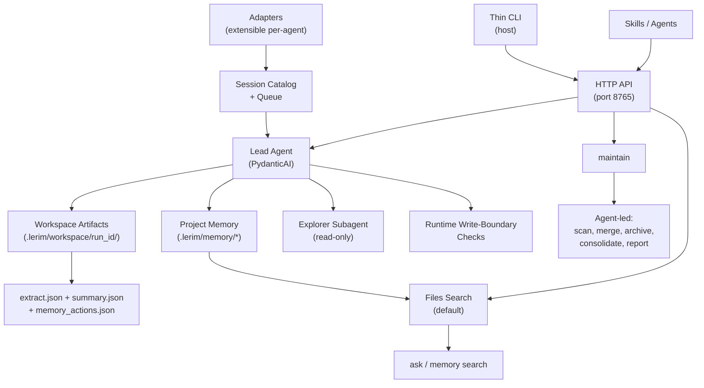

# System Architecture

Lerim is the file-first continual learning and context graph layer for AI coding
agents. This page describes the system design, components, and runtime boundaries.

## Design principles

<div class="grid cards" markdown>

-   :material-file-document: **File-first**

    ---

    Memory is plain markdown files. No proprietary format, no database lock-in.
    Files are the canonical store; indexes are optional accelerators.

-   :material-shape-outline: **Primitive-first**

    ---

    Three memory primitives: `decisions`, `learnings`, `summaries`. Each has
    lean frontmatter and a markdown body. No sidecars.

-   :material-folder-account: **Project-scoped**

    ---

    Memories belong to the project where they were learned. Each repo gets its
    own `.lerim/` directory. Global fallback is configured but not yet active.

-   :material-shield-check: **Write-boundary enforced**

    ---

    Only the lead agent can write memory. All writes go through boundary-checked
    runtime tools. The explorer subagent is strictly read-only.

</div>

## System components

| Component | Runtime | Purpose |
|-----------|---------|---------|
| **Lead agent** | PydanticAI | Orchestrates sync/maintain/ask, delegates to explorer, makes add/update/no-op decisions, writes memory |
| **Explorer subagent** | PydanticAI | Read-only candidate gathering (`read`, `glob`, `grep`) |
| **Extract pipeline** | DSPy ChainOfThought | Extracts decision/learning candidates from session transcripts |
| **Summarize pipeline** | DSPy ChainOfThought | Generates structured session summaries |
| **Session catalog** | SQLite | Indexes sessions, FTS, job queue, service run log |
| **Adapters** | Python | Platform-specific session readers (extensible via adapter protocol) |
| **HTTP API** | Starlette | JSON API for CLI, skills, agents, and dashboard UI |
| **Dashboard** | HTML/JS | Local UI for session analytics, knowledge browsing, pipeline status |
| **Ollama lifecycle** | httpx | Loads/unloads local models before and after each sync/maintain cycle to free GPU/RAM |

## Deployment model

Lerim runs as a single process (`lerim serve`) that provides the daemon loop +
HTTP API + dashboard. This typically runs inside Docker via `lerim up`, but can
run directly for development.

```
CLI / clients                       lerim serve (Docker or direct)
-------------------------------------------------------------
lerim ask "q"   --HTTP POST-->     /api/ask
lerim sync      --HTTP POST-->     /api/sync
lerim maintain  --HTTP POST-->     /api/maintain
lerim status    --HTTP GET--->     /api/status
skills (curl)   --HTTP-------->     /api/*
browser         --HTTP-------->     dashboard UI

lerim init        (host only)
lerim project add (host only)
lerim up/down     (host only)
```

!!! info "Setup"
    `pip install lerim && lerim init && lerim project add . && lerim up`

## System flow



## Storage model

### Per-project: `<repo>/.lerim/`

Each registered project stores its own memories and run artifacts:

```
<repo>/.lerim/
  config.toml                        # project overrides
  memory/
    decisions/*.md                   # decision memory files
    learnings/*.md                   # learning memory files
    summaries/YYYYMMDD/HHMMSS/*.md   # session summaries
    archived/
      decisions/*.md                 # soft-deleted decisions
      learnings/*.md                 # soft-deleted learnings
  workspace/
    sync-<YYYYMMDD-HHMMSS>-<id>/     # sync run artifacts
      extract.json
      summary.json
      memory_actions.json
      agent.log
      subagents.log
      session.log
    maintain-<YYYYMMDD-HHMMSS>-<id>/ # maintain run artifacts
      maintain_actions.json
      agent.log
      subagents.log
  index/
    memories.sqlite3                 # memory access tracker
```

### Global: `~/.lerim/`

Shared across all projects:

```
~/.lerim/
  config.toml                        # user configuration
  index/
    sessions.sqlite3                 # session catalog, FTS, job queue, run log
  cache/                             # session trace caches per platform
  activity.log                       # append-only activity log
  docker-compose.yml                 # generated by lerim up
  platforms.json                     # platform detection cache
```

## Scope resolution

Config precedence (low to high):

| Priority | Source |
|----------|--------|
| 1 | `src/lerim/config/default.toml` (package defaults) |
| 2 | `~/.lerim/config.toml` (user global) |
| 3 | `<repo>/.lerim/config.toml` (project overrides) |
| 4 | `LERIM_CONFIG` env var (explicit override) |

Memory scope modes (via `[memory] scope`):

| Mode | Behavior |
|------|----------|
| `project_fallback_global` | Per-project storage. Global fallback configured but not yet implemented. |
| `project_only` | Per-project only. |
| `global_only` | All memories in `~/.lerim/memory/`. |

## Runtime paths

### Sync path (hot)

1. Adapters discover new sessions from connected platforms
2. Sessions are indexed into the catalog and enqueued
3. Lead agent receives `trace_path`, creates workspace folder
4. DSPy extraction produces `extract.json` (decision/learning candidates)
5. DSPy summarization produces `summary.json`
6. Lead agent runs deterministic decision policy (`add | update | no-op`)
7. Memory files are written through boundary-enforced tools

### Maintain path (cold)

1. Iterates over all registered projects
2. Lead agent scans existing memories per project
3. Merges duplicates, archives low-value entries
4. Consolidates related memories
5. Applies time-based confidence decay
6. Creates new consolidated memories, soft-deletes to `archived/`

!!! note "Local model lifecycle"
    When roles use `provider = "ollama"`, the lifecycle context manager
    warm-loads models before each cycle and unloads them after
    (`keep_alive: 0`) to free 5-10 GB of RAM between runs. Disable
    with `auto_unload = false` in `[providers]`.

### Query path (read-only)

`lerim ask` and `lerim memory search` are read-only. They search project
memory files and return results with evidence of which memories were used.

## HTTP API

| Method | Endpoint | Purpose |
|--------|----------|---------|
| `GET` | `/api/health` | Health check (Docker HEALTHCHECK + CLI detection) |
| `GET` | `/api/status` | Runtime state |
| `POST` | `/api/ask` | Query memories |
| `POST` | `/api/sync` | Trigger sync |
| `POST` | `/api/maintain` | Trigger maintenance |
| `GET` | `/api/memories` | List memories |
| `GET` | `/api/search` | Search memories |
| `GET` | `/api/connect` | List connected platforms |
| `POST` | `/api/connect` | Connect a platform |
| `GET` | `/api/project/list` | List registered projects |
| `POST` | `/api/project/add` | Register a project |

Full endpoint list in `src/lerim/app/dashboard.py`.

## Security boundaries

- **Write boundary**: runtime tools deny `write` and `edit` outside `memory_root` and workspace roots
- **Structured writes**: memory files (decisions/learnings) can only be created via the `write_memory` tool, which accepts structured fields and builds markdown in Python -- the LLM never assembles frontmatter directly
- **Path enforcement**: `write` tool rejects memory primitive paths with `ModelRetry`, directing the LLM to use `write_memory` instead
- **No shell**: all file operations use Python tools (no shell/subprocess)
- **Read-only explorer**: explorer subagent has `read`, `glob`, `grep` only
- **Localhost binding**: HTTP API binds to `127.0.0.1` by default (no auth needed for localhost)
