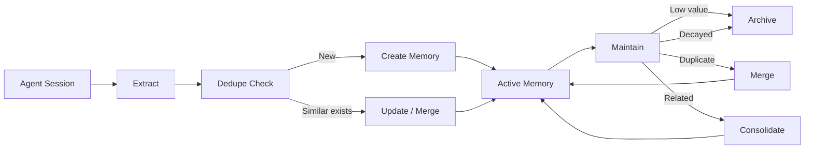

# Memory Model

Lerim stores memories as plain markdown files with YAML frontmatter. No database required — files are the canonical store. Both humans and agents can read and edit them directly.

---

## Primitives

Lerim uses two core memory types (primitives) plus episodic summaries:

| Primitive | Purpose | Example |
|-----------|---------|---------|
| **Decision** | An architectural or design choice made during development | "Use JWT bearer tokens for API auth" |
| **Learning** | A reusable insight, procedure, friction point, or preference | "pytest fixtures must be in conftest.py for discovery" |
| **Summary** | An episodic record of what happened in a coding session | "Refactored auth module, added rate limiting" |

Decisions and learnings are the durable primitives — they persist and are refined over time. Summaries are episodic records written once per session and not modified by the maintain path.

---

## Learning kinds

Learnings are categorized by kind to distinguish different types of knowledge:

| Kind | Description | Example |
|------|-------------|---------|
| `insight` | A general observation or understanding | "FastAPI dependency injection resolves at request time, not import time" |
| `procedure` | A step-by-step process or workflow | "To add a new adapter: create module, implement protocol, register in registry" |
| `friction` | Something that caused difficulty or slowdown | "Edit tool fails when target string appears in multiple files" |
| `pitfall` | A mistake or trap to avoid | "Never run migrations on production without a backup" |
| `preference` | A stylistic or tooling preference | "Always use pathlib over os.path" |

---

## Directory layout

### Project scope

```text
<repo>/.lerim/
├── config.toml                          # project overrides
├── memory/
│   ├── decisions/
│   │   └── <slug>.md                    # decision memory files
│   ├── learnings/
│   │   └── <slug>.md                    # learning memory files
│   ├── summaries/
│   │   └── YYYYMMDD/
│   │       └── HHMMSS/
│   │           └── <slug>.md            # session summaries
│   └── archived/
│       ├── decisions/
│       │   └── <slug>.md                # soft-deleted decisions
│       └── learnings/
│           └── <slug>.md                # soft-deleted learnings
├── meta/
│   └── traces/
│       └── sessions/
│           └── <agent>/
│               └── <run_id>.jsonl       # session trace references
├── workspace/
│   ├── sync-<YYYYMMDD-HHMMSS>-<shortid>/
│   │   ├── extract.json
│   │   ├── summary.json
│   │   ├── memory_actions.json
│   │   ├── agent.log
│   │   ├── subagents.log
│   │   └── session.log
│   └── maintain-<YYYYMMDD-HHMMSS>-<shortid>/
│       ├── maintain_actions.json
│       ├── agent.log
│       └── subagents.log
└── index/
    └── memories.sqlite3                 # memory access tracker (decay/archiving)
```

### Global scope

The global fallback at `~/.lerim/` follows the same `memory/` layout. Additionally, it contains shared infrastructure:

```text
~/.lerim/
├── config.toml                          # user global configuration
├── index/
│   └── sessions.sqlite3                 # session catalog, FTS, job queue
├── cache/                               # session trace caches per platform
├── activity.log                         # append-only activity log
├── docker-compose.yml                   # generated by lerim up
└── platforms.json                       # platform detection cache
```

---

## Scope resolution

| Scope | Read behavior | Write behavior |
|-------|---------------|----------------|
| `project_fallback_global` (default) | Read from project first, fall back to global | Write to project |
| `project_only` | Project only | Project only |
| `global_only` | Global only (`~/.lerim/memory/`) | Global only |

!!! info "Global fallback status"
    The `project_fallback_global` scope mode is configured as the default, but the global memory fallback is **not yet implemented** in the runtime. In practice, memories are always per-project.

Configure scope in your config:

```toml
[memory]
scope = "project_only"    # project_fallback_global | project_only | global_only
```

---

## Frontmatter specs

All metadata lives in YAML frontmatter — no sidecars, no external databases.

### Decision frontmatter

```yaml
---
id: dec-abc123
title: Use JWT bearer tokens for API auth
created: "2026-02-20T10:30:00Z"
updated: "2026-02-20T10:30:00Z"
source: sync
confidence: 0.85
tags:
  - auth
  - api
  - security
---

Bearer tokens with short expiry (15min) and refresh tokens.
The auth middleware validates JWTs on every request...
```

**Fields:** `id`, `title`, `created`, `updated`, `source`, `confidence`, `tags`

### Learning frontmatter

```yaml
---
id: lrn-def456
title: pytest fixtures must be in conftest.py
created: "2026-02-21T14:00:00Z"
updated: "2026-02-21T14:00:00Z"
source: sync
confidence: 0.7
tags:
  - testing
  - pytest
kind: insight
---

Fixtures defined in test files are not discovered by other test files.
Always place shared fixtures in conftest.py for proper discovery...
```

**Fields:** `id`, `title`, `created`, `updated`, `source`, `confidence`, `tags`, `kind`

### Summary frontmatter

```yaml
---
id: sum-ghi789
title: Refactored auth module
description: Added rate limiting and improved token validation
date: "2026-02-22"
time: "15:30:00"
coding_agent: claude
raw_trace_path: meta/traces/sessions/claude/abc123.jsonl
run_id: abc123
repo_name: my-project
created: "2026-02-22T15:45:00Z"
source: sync
tags:
  - auth
  - refactoring
---

## Session Summary

Refactored the authentication module to add rate limiting
and improve token validation logic...
```

**Fields:** `id`, `title`, `description`, `date`, `time`, `coding_agent`, `raw_trace_path`, `run_id`, `repo_name`, `created`, `source`, `tags`

---

## Memory lifecycle



The lifecycle follows four stages:

1. **Extract** — The DSPy extraction pipeline finds decision and learning candidates from session transcripts.
2. **Dedupe** — The lead agent compares candidates against existing memories. If a similar memory exists, it updates/merges. Otherwise, it creates a new entry.
3. **Create / Update** — New memories are written via the `write_memory` tool. Updates modify existing files in place.
4. **Maintain** — Periodic offline refinement merges duplicates, consolidates related memories, archives low-value entries, and applies time-based decay.

---

## Confidence and decay

Each memory has a `confidence` score (0.0 to 1.0) assigned during extraction. Over time, memories that are not accessed lose effective confidence through decay.

| Parameter | Default | Description |
|-----------|---------|-------------|
| `decay_days` | `180` | Days of no access before full decay applies |
| `min_confidence_floor` | `0.1` | Decay never drops effective confidence below this value |
| `archive_threshold` | `0.2` | Effective confidence below this triggers archiving during maintain |
| `recent_access_grace_days` | `30` | Memories accessed in the last 30 days skip archiving regardless of score |

### How it works

- A brand-new memory starts with its assigned confidence (e.g., 0.85).
- Every time a memory is retrieved (via `ask`, `memory search`, or agent queries), its last-accessed timestamp resets.
- If a memory goes unaccessed, its effective confidence decays linearly over `decay_days`.
- The floor ensures no memory drops below 0.1 effective confidence.
- During `maintain`, memories below the archive threshold (and outside the grace period) are soft-deleted to `memory/archived/`.

Configuration:

```toml
[memory.decay]
enabled = true
decay_days = 180
min_confidence_floor = 0.1
archive_threshold = 0.2
recent_access_grace_days = 30
```

!!! tip "Accessing memories resets decay"
    Querying memories with `lerim ask` or `lerim memory search` updates access timestamps. Frequently useful memories naturally stay alive — unused memories fade and are eventually archived.

---

## Reset policy

Memory reset is explicit and destructive. It deletes `memory/`, `workspace/`, and `index/` under the selected scope(s), then recreates canonical folders.

```bash
lerim memory reset --scope both --yes     # wipe everything
lerim memory reset --scope project --yes  # project data only
lerim memory reset --scope global --yes   # global data only
```

| Scope | What it resets |
|-------|----------------|
| `project` | `<repo>/.lerim/` only |
| `global` | `~/.lerim/` only (includes sessions DB) |
| `both` (default) | Both project and global |

!!! warning "Sessions DB scope"
    The sessions DB lives in global `index/sessions.sqlite3`, so `--scope project` alone does **not** reset the session queue. Use `--scope global` or `--scope both` to fully reset indexing state.

### Fresh start

```bash
lerim memory reset --yes            # wipe everything
lerim sync --max-sessions 5         # re-sync newest conversations
```

---

## Next steps

<div class="grid cards" markdown>

-   :material-cog:{ .lg .middle } **How It Works**

    ---

    Architecture overview, data flow, and deployment model.

    [:octicons-arrow-right-24: How it works](how-it-works.md)

-   :material-sync:{ .lg .middle } **Sync & Maintain**

    ---

    Deep dive into extraction, deduplication, and memory refinement.

    [:octicons-arrow-right-24: Sync & maintain](sync-maintain.md)

-   :material-robot:{ .lg .middle } **Supported Agents**

    ---

    Which coding agents Lerim can ingest sessions from.

    [:octicons-arrow-right-24: Supported agents](supported-agents.md)

-   :material-tune:{ .lg .middle } **Configuration**

    ---

    Decay settings, model roles, and scope options.

    [:octicons-arrow-right-24: Configuration](../configuration/overview.md)

</div>
