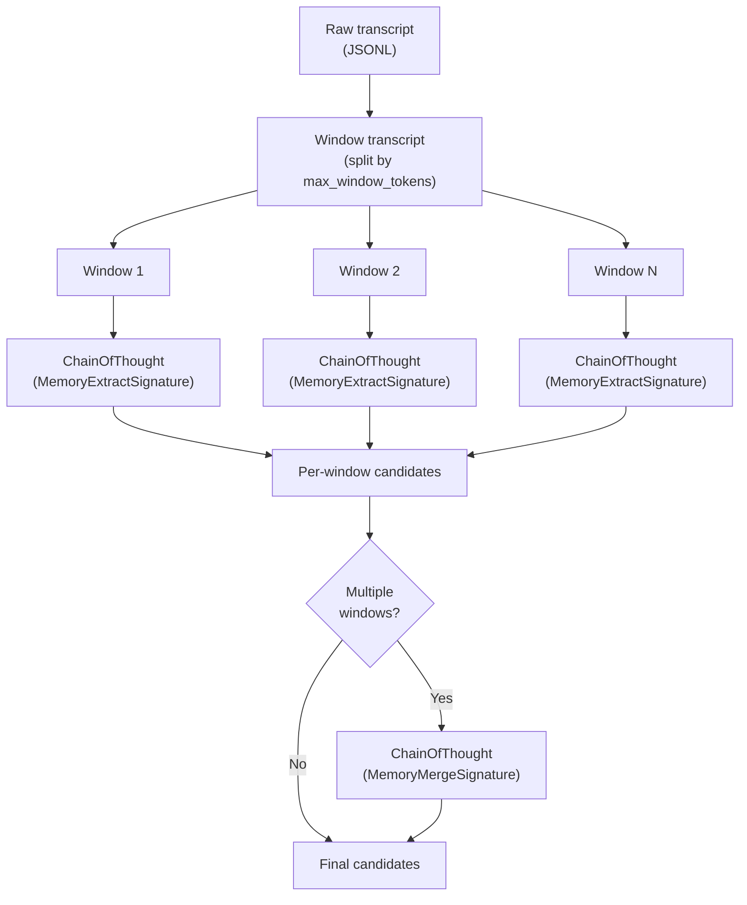

# Sync & Maintain

Lerim has two runtime paths that keep your memory store accurate and clean:

- **Sync** (hot path) — processes new agent sessions and extracts memories
- **Maintain** (cold path) — refines existing memories offline

Both run automatically in the daemon loop and can also be triggered manually.

---

## Sync path

The sync path turns raw agent session transcripts into structured memories.

### Detailed steps

1. **Discover sessions**
    - Platform adapters scan configured session directories for new or changed sessions.
    - Each adapter calls `iter_sessions()` with the current time window and a set of known content hashes.
    - New sessions and sessions whose content has changed are returned as `SessionRecord` entries.

2. **Index sessions**
    - New sessions are inserted into the session catalog (`~/.lerim/index/sessions.sqlite3`).
    - Metadata is recorded: run ID, agent type, session path, repo path, start time, message count, tool calls, errors, token count, and content hash.

3. **Match to project**
    - Each session's `repo_path` is compared against registered projects in `config.projects`.
    - Sessions matching a project are enqueued as extraction jobs.
    - Sessions that don't match any project are indexed but **not** extracted — no memories are written.

4. **Claim jobs**
    - The daemon claims pending jobs from the queue in **chronological order** (oldest-first).
    - This ordering ensures that later sessions can correctly update or supersede memories created by earlier ones.
    - A heartbeat thread runs every 15 seconds to prevent stale job detection during long extractions.

5. **Read transcript**
    - The raw session trace file is read directly from disk (JSONL or exported JSONL).
    - Lerim does not copy traces — it reads from the source path stored in the session record.

6. **Extract candidates (DSPy)**
    - The transcript is split into overlapping windows based on `max_window_tokens` (default: 300,000) and `window_overlap_tokens` (default: 5,000).
    - Each window is processed by `dspy.ChainOfThought` with `MemoryExtractSignature`.
    - The signature instructs the model to find decisions and learnings, classify learning kinds, assign confidence scores, and extract short evidence quotes.
    - If multiple windows were processed, a second `MemoryMergeSignature` call deduplicates and merges the per-window results.

7. **Lead agent deduplication**
    - The lead agent (PydanticAI) receives the extracted candidates.
    - It uses read-only tools (`read`, `glob`, `grep`) and the explorer subagent to compare candidates against existing memories.
    - For each candidate, it decides: `add` (new memory), `update` (merge into existing), or `no-op` (already covered).

8. **Write memories**
    - New memories are written via the `write_memory` tool, which accepts structured fields and builds the markdown file with frontmatter in Python.
    - Updated memories are modified in place via the `edit` tool.
    - All writes are boundary-checked to stay inside the project's `memory_root`.

9. **Write summary**
    - An episodic summary is generated via the `TraceSummarySignature` DSPy pipeline.
    - The summary is written to `memory/summaries/YYYYMMDD/HHMMSS/{slug}.md`.

10. **Record artifacts**
    - Run evidence is stored in the workspace folder (`sync-<timestamp>-<id>/`):
        - `extract.json` — raw extraction results
        - `summary.json` — summarization results
        - `memory_actions.json` — add/update/no-op decisions with reasoning
        - `agent.log` — lead agent execution log
        - `subagents.log` — explorer subagent log
        - `session.log` — session processing log

---

### Time window configuration

The sync path only processes sessions within a configurable time window:

| Config key | Default | Description |
|------------|---------|-------------|
| `sync_window_days` | `7` | How far back to look for sessions |
| `sync_max_sessions` | `50` | Maximum sessions to process per sync cycle |

You can override the window with CLI flags:

```bash
lerim sync --window 14d              # last 14 days
lerim sync --window 2h               # last 2 hours
lerim sync --window all              # all sessions ever
lerim sync --since 2026-02-01        # since a specific date
lerim sync --max-sessions 10         # limit batch size
```

### Session processing order

Sessions are processed in **chronological order** (oldest-first). This is intentional:

!!! info "Why oldest-first?"
    Processing sessions chronologically ensures that decisions made in earlier sessions are written to memory before later sessions are processed. A later session might reference, update, or supersede an earlier decision — processing in order allows the deduplication step to correctly detect these relationships.

---

## Extraction pipeline

The DSPy extraction pipeline is the core intelligence of the sync path.



### Windowing

Large transcripts are split into overlapping windows to fit within model context limits:

| Parameter | Default | Description |
|-----------|---------|-------------|
| `max_window_tokens` | `300,000` | Maximum tokens per window |
| `window_overlap_tokens` | `5,000` | Token overlap between adjacent windows |

Overlap ensures that context at window boundaries is not lost. For most sessions, a single window suffices. Very long sessions (multi-hour pair programming) may produce 2-3 windows.

### Extraction signature

The `MemoryExtractSignature` receives:

- **transcript** — raw session text (one window)
- **metadata** — session metadata (run ID, agent type, repo)
- **metrics** — deterministic metrics (message count, tool calls, errors)
- **guidance** — optional natural language hints from the lead agent

It outputs a list of `MemoryCandidate` objects, each with:

- `primitive` — `decision` or `learning`
- `title` — short descriptive title
- `body` — full memory content
- `kind` — learning kind (`insight`, `procedure`, `friction`, `pitfall`, `preference`)
- `confidence` — extraction confidence (0.0 to 1.0)
- `tags` — descriptive labels
- `evidence` — short quote from the transcript (max 200 chars)

### Merge signature

When multiple windows are processed, `MemoryMergeSignature` deduplicates the combined candidates — removing near-duplicates (keeping the highest-confidence version) and dropping weak or redundant items.

---

## Maintain path

The maintain path runs offline refinement over stored memories. It iterates over all registered projects, running a separate agent instance for each project's memory root.

### Detailed steps

1. **Scan memories**
    - The maintain agent reads all active memories in the project's `memory/decisions/` and `memory/learnings/` directories.
    - It uses read-only tools to load file contents and frontmatter.

2. **Merge duplicates**
    - Identifies memories that cover the same concept or decision.
    - Merges them into a single, stronger entry (keeping the highest confidence, combining evidence).
    - The weaker duplicate is soft-deleted to `memory/archived/`.

3. **Archive low-value**
    - Memories with effective confidence below the archive threshold (default: 0.2) are candidates for archiving.
    - Memories accessed in the last 30 days (grace period) are skipped.
    - Archived memories are moved to `memory/archived/decisions/` or `memory/archived/learnings/`.

4. **Consolidate related**
    - Related memories that complement each other (e.g., a decision and the learning that motivated it) may be consolidated into a richer entry.
    - New consolidated memories are created via `write_memory`.

5. **Apply decay**
    - Time-based confidence decay is calculated for each memory based on its last access timestamp.
    - The access tracker (`index/memories.sqlite3`) records when each memory was last read.

6. **Record artifacts**
    - Maintain actions are recorded in `maintain-<timestamp>-<id>/maintain_actions.json`.
    - Counts of `merged`, `archived`, `consolidated`, and `decayed` memories are logged.

---

## Memory decay mechanics

Decay reduces the effective confidence of memories that haven't been accessed recently. This keeps the memory store focused on relevant, actively-used knowledge.

### Formula

Effective confidence is computed as:

```
days_since_access = (now - last_accessed).days
decay_factor = max(min_confidence_floor, 1.0 - (days_since_access / decay_days))
effective_confidence = confidence * decay_factor
```

### Configuration

```toml
[memory.decay]
enabled = true
decay_days = 180                    # full decay after 6 months of no access
min_confidence_floor = 0.1          # never decay below 10%
archive_threshold = 0.2             # archive if effective confidence < 20%
recent_access_grace_days = 30       # skip archiving if accessed in last 30 days
```

### Example timeline

| Day | Event | Effective confidence |
|-----|-------|---------------------|
| 0 | Memory created (confidence: 0.8) | 0.80 |
| 30 | Not accessed | 0.67 |
| 90 | Queried via `lerim ask` — access timestamp resets | 0.80 (reset) |
| 180 | Not accessed (90 days since reset) | 0.40 |
| 270 | Not accessed (180 days since reset) | 0.08 → floor 0.10 |
| 271 | Maintain runs — effective 0.10 < threshold 0.2 — **archived** | — |

!!! warning "Disabling decay"
    Set `enabled = false` to disable decay entirely. All memories will retain their original confidence indefinitely. This is not recommended for long-running projects as the memory store will grow unbounded.

---

## When sync and maintain run automatically

The daemon runs two independent loops with configurable intervals:

| Path | Config key | Default | Description |
|------|------------|---------|-------------|
| Sync | `sync_interval_minutes` | `10` | How often the hot path runs |
| Maintain | `maintain_interval_minutes` | `60` | How often the cold path runs |

Both paths trigger immediately on daemon startup, then repeat at their configured intervals.

```toml
[server]
sync_interval_minutes = 10          # sync every 10 minutes
maintain_interval_minutes = 60      # maintain every hour
sync_window_days = 7                # look back 7 days for sessions
sync_max_sessions = 50              # max sessions per sync cycle
```

### Local model memory management

When using Ollama (local models), Lerim automatically loads the model into RAM
before each sync/maintain cycle and unloads it immediately after. This means the
model (5-10 GB) only occupies memory during active processing, not between
cycles. The Ollama process itself stays running with minimal footprint (~50-100 MB).

This behavior is controlled by `auto_unload` in `[providers]` (default: `true`).
Set `auto_unload = false` to keep models loaded between cycles for faster
response at the cost of persistent RAM usage.

### Manual triggers

You can also trigger either path manually via the CLI (requires `lerim serve` or `lerim up` running):

=== "Sync"

    ```bash
    lerim sync                           # sync with default settings
    lerim sync --run-id <id>             # sync a specific session
    lerim sync --window 30d              # sync last 30 days
    lerim sync --max-sessions 5          # limit to 5 sessions
    lerim sync --dry-run                 # preview without writing
    ```

=== "Maintain"

    ```bash
    lerim maintain                       # run maintain cycle
    lerim maintain --dry-run             # preview without writing
    ```

### Locking

Sync and maintain share a filesystem write lock (`writer.lock`) to prevent concurrent writes. If one path is running, the other waits. The lock includes:

- PID-based ownership
- Heartbeat timestamps (stale lock detection after 60 seconds)
- Automatic reclamation of stale locks from crashed processes

---

## Related

<div class="grid cards" markdown>

-   :material-cog:{ .lg .middle } **How It Works**

    ---

    Architecture overview, agent orchestration, and security boundaries.

    [:octicons-arrow-right-24: How it works](how-it-works.md)

-   :material-brain:{ .lg .middle } **Memory Model**

    ---

    Primitives, frontmatter specs, lifecycle, and confidence decay.

    [:octicons-arrow-right-24: Memory model](memory-model.md)

-   :material-robot:{ .lg .middle } **Supported Agents**

    ---

    Platform adapters and session formats.

    [:octicons-arrow-right-24: Supported agents](supported-agents.md)

-   :material-tune:{ .lg .middle } **Configuration**

    ---

    Full TOML config reference including intervals, models, and decay.

    [:octicons-arrow-right-24: Configuration](../configuration/overview.md)

</div>
